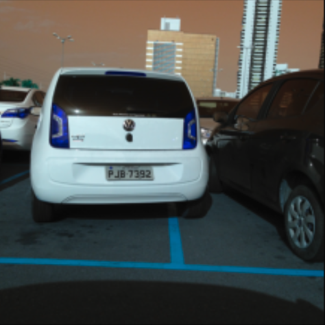

PlateRecognition
==============================

This project aim to build an on premise licence plate recognition model.

Project Organization
------------

    ├── LICENSE
    ├── Makefile           <- Makefile with commands like `make requirements` 
    ├── README.md          <- The top-level README for developers using this project.
    ├── data
    │   ├── external       <- Data from third party sources.
    │   ├── interim        <- Intermediate data that has been transformed.
    │   ├── processed      <- The final, canonical data sets for modeling.
    │   └── raw            <- The original, immutable data dump.
    │
    ├── docs               <- A default Sphinx project; see sphinx-doc.org for details
    │
    ├── models             <- scripts to predict and train on models
    │
    ├── notebooks          <- Jupyter notebooks. Naming convention is a number (for ordering),
    │                         the creator's initials, and a short `-` delimited description, e.g.
    │                         `1.0-jqp-initial-data-exploration`.
    │
    ├── reports            <- Generated analysis as HTML, PDF, LaTeX, etc.
    │   └── figures        <- Generated graphics and figures to be used in reporting
    │
    ├── requirements.txt   <- The requirements file for reproducing the analysis environment, e.g.
    │                         generated with `pip freeze > requirements.txt`
    │
    ├── setup.py           <- makes project pip installable (pip install -e .) so src can be imported
    ├── src                <- Source code for use in this project.
    │   ├── __init__.py    <- Makes src a Python module
    │   │
    │   ├── models         <- Scripts to create models


# Getting Started

##	Installation process
Be sure you're connected to the feed and use this command to install TSODA through pip:

```
make requirements
```

##	Software dependencies

- Python 3.6, 3.7
- Tensorflow 1.15.2

To check all packages requirements, please see requirements.txt.

##	Latest releases
- v0.1.0 
    - bboxes finder
    - OCR

# Build and Test
You can import a class of bboxes finder and a class of OCR. 
> :warning: **The following quotations aren't running**:
You can find in the models folder a lot of scripts about how to train and predict with NNs and  extract/preprocess data.

This quotations are here to get a quick view at how to import models and to know how 
structured input/ output data have to be.
```Python
from src.models.model_bboxes import PlaqueFinder
from src.models.model_OCR import PlaqueOCR
```

```Python
#-----------------------------
#   Test train PlaqueFinder
#-----------------------------
index = ['train_input', 'the_labels', 'input_length', 'label_length']

X_train = np.ones((1, 128, 64, 3))
Y_train = [[0.9, 0.3, 0.1, 0.1]] # x, y, h, w in % of image height and width


PF = PlaqueFinder(shape=(224, 224, 3), weight=None, loss='iou')

epochs = 200
batch_size = 8

PF.train(x_train=X_train,
         y_train=Y_train,
         batch_size=batch_size,
         epochs=epochs,
         validation_data=(X_val, y_val))

#-----------------------------
#      Test train OCR
#-----------------------------
from src.models.utils import gen_flow_for_two_inputs
index = ['train_input', 'the_labels', 'input_length', 'label_length']

input_train = {'train_input': np.ones((1, 128, 64, 3)),
               'the_labels' : [[0, 1, 2]], # For ABC
               'input_length': [30],
               'label_length': [3]}

output_train = {'ctc': [0]} # Vector of zeros


print('Train a GRU')
POCR = PlaqueOCR(shape=(128, 64, 3),
                 shapes=[10],
                 gru=512,
                 optimizers=Adadelta(lr=0.8))


gen_flow = gen_flow_for_two_inputs(input_train, output_train['ctc'])

POCR.train_generator(gen_flow=gen_flow,
                     epochs=100,
                     steps_per_epoch=len(input_train['train_input']) / 32,
                     validation_data=(input_val, output_val))

```

# Results
## PlaqueFinder
| Image with context   |   Resized Image  |
|:--------------------:|:----------------:|
| ||

## Embeding PlaqueFinder with [Darflow](https://github.com/thtrieu/darkflow)
| Image with context  | ROI Image selected | Resized Image |
|:-------------------:|:------------------:|:-------------:|
| |||

## OCR
| Resized Image   |   Text   |
|:---------------:|:--------:|
| |PJB7392|


# Contribute
- [ ] Add probability of containing a licence plate 
- [ ] Create an Autoencoder for resized image denoising (& Centering ?) before OCR
- [ ] Docstrings
- [ ] Sphinx autodoc
- [ ] Unit test
